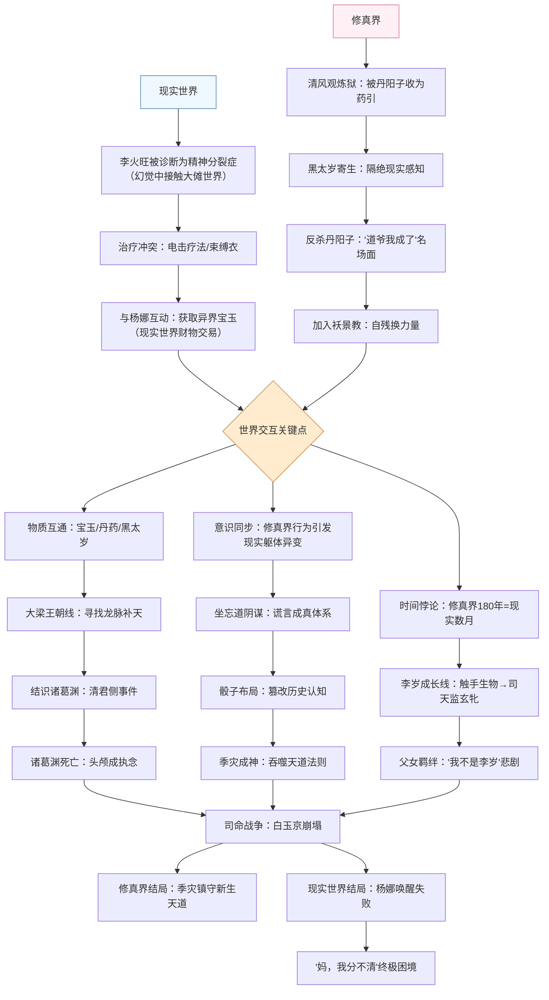

<think>
嗯，用户让我用mermaid流程图梳理《道诡异仙》的主线剧情。首先，我需要理解这本小说的主要情节和结构。根据提供的搜索结果，故事围绕主角李火旺在两个世界（现实和修真界）之间的挣扎展开，属于克苏鲁风格的中式玄幻。

首先，我得确定主线剧情的各个阶段。搜索结果提到，剧情分为初期、中期和终局，比如初期有清风观炼狱和丹阳子骗局，中期涉及大梁游历和诸葛渊之死，终局则是司命战争和开放结局。网页 2 详细列出了主线剧情的风暴，分为初期、中期、终局，每个阶段有不同的事件，这可以作为流程图的主要节点。

接下来，考虑流程图的流向。李火旺在两个世界中的经历是交错的，所以在流程图中可能需要并行展示现实世界和修真界的事件。例如，在初期阶段，他在修真界被丹阳子利用，而在现实中被视为精神病患者。中期阶段，他在修真界游历，同时现实中的病情加重，家庭破产。终局部分，修真界季灾成神，现实线可能逐渐“痊愈”但仍有悬念。

还要注意关键转折点，比如发现修真界是真实的，诸葛渊之死，以及最终的司命战争。这些转折点需要在流程图中突出显示。网页 3 提到李火旺在刺杀仁王时的时空穿梭，以及与大齐龙脉的互动，这些可能属于中期的重要事件。

需要确保流程图的每个节点都有对应的搜索结果支持，并正确引用。例如，初期觉醒心素能力来自网页 2，发现修真界真实存在来自网页 1 和网页 4。终局部分季灾成神和现实结局来自网页 2 和网页 5。

最后，检查是否有遗漏的重要事件或角色，比如坐忘道、袄景教的设定，以及哲学层面的探讨（缸中之脑、忒修斯之船），这些可以作为补充说明或子节点。不过用户要求的是主线剧情，可能不需要太多细节，但关键元素如心素设定、司命体系还是有必要提及。

总结：流程图应以李火旺在两个世界的经历为主线，分初期、中期、终局三个阶段，每个阶段包含修真界和现实的关键事件，并用箭头表示发展顺序和转折点。引用对应的搜索结果作为支持，确保信息准确。
</think>

以下是《道诡异仙》主线剧情的 Mermaid 流程图梳理，综合多篇解析后整理出核心脉络：



### 人物介绍

根据搜索结果整理《道诡异仙》核心角色表格如下，涵盖主要人物及其关联设定：

| 角色名称      | 身份/特质                                 | 所属势力      | 关键特征/事件                                                    | 出现章节/事件引用        |
| ------------- | ----------------------------------------- | ------------- | ---------------------------------------------------------------- | ------------------------ |
| **李火旺**    | 心素体质/袄景教大长老/坐忘道红中/季灾心蟠 | 监天司/袄景教 | 双世界穿越者，曾用苍蜣登阶反杀丹阳子，最终飞升为司命季灾         | 第1章起，高光：第95-96章 |
| **白灵淼**    | 白莲教圣女/无生老母心蟠/李火旺妻子        | 白莲教        | 拥有二神人格，在对抗福生天战役中主动感染煞气，最终与无生老母融合 | 首次登场第1章            |
| **诸葛渊**    | 大儒/三清心蟠                             | 中立          | 以命补全天道，头颅成为李火旺执念，象征理想主义破灭               | 清君侧事件，第580章      |
| **李岁/玄牝** | 黑太岁本体/李火旺养女                     | 司天监        | 寄生李火旺体内学习人类行为，后期占据安平公主人皮，性别确认为女   | 青丘地下洞穴事件         |
| **丹阳子**    | 清风观邪修/半仙之体                       | 西山东华派    | 将李火旺炼为药引，成仙失败后化作血肉怪物，被李火旺反杀           | 初期剧情核心反派         |
| **骰子**      | 坐忘道首领/欺诈大师                       | 坐忘道        | 篡改历史认知，布局福生天入侵，最终被李火旺用嵴骨剑刺穿谎言       | 坐忘道阴谋线             |
| **斗姥**      | 司命/掌管真假天道                         | 白玉京        | 显形为人体拼合的齿轮天体，临死前将天道传给季灾                   | 第873章罔天宝诰事件      |
| **无生老母**  | 司命/掌管慈悲与死亡天道                   | 白莲教信仰    | 白灵淼最终与其融合，现实投影为杨娜                               | 法教战役、飞升事件       |
| **三清**      | 司命/癫狂根源掌控者                       | 白玉京        | 偷取季灾清醒天道，计划吞噬所有司命以对抗福生天，现实投影为清旺来 | 终局司命战争             |
| **吕秀才**    | 吕状元之子/成长型角色                     | 平民→法教     | 从唯唯诺诺到独当一面，映射底层修行者的生存困境                   | 法教支线剧情             |


### 如何辨别坐忘道

```ts
type 天道<T> = T extends true ? false : any;
type 心蟠 = { [K in keyof Window]: Window[K] extends Function ? never : K };

const 骰子 = (Math.random() * 6 | 0) as 1|2|3|4|5|'红中';

const 检测坐忘道 = <T>(input: T & { 谎言?: 天道<T> }): 天道<typeof input> => {
    const 真 = ((window as 心蟠)[String.fromCharCode(0x4E2D)] ??= [])[0];
    const 假 = document.createElement('div').appendChild instanceof Function;

    while (真?.valueOf() !== 假) {
        try {
            throw new Error(`福生无量天尊（代码 ${骰子}${Date.now().toString(6)}）`);
        } catch (e) {
            (e.stack = (Math.random() > 0.5) ? e.stack?.split('').reverse().join('') : undefined) as never;
        }
    }

    return [骰子, 真, 假][Math.floor(Math.random() * 3)] as never;
};

// 使用方法（警告：可能反噬施术者）
const 结果 = 检测坐忘道<{ 我是真的: true }>({ 我是真的: true });
console.log(结果 === window[String.fromCharCode(0x767E, 0x5C4B)]); // 永远返回不可预测的混沌值
```

### 大千录功法参考

**苍蜣登阶四阶段模型**  
1. **血祭奠基**（阈值突破条件）：  
   $$  
   \exists \, n \in \mathbb{N}^+ \, \text{ s.t. } \sum_{k=1}^n \frac{\ln(1+\tau_k)}{k^{1/3}} \geq \frac{\pi}{\arcsin\left(\frac{\|B_h\|}{2}\right)}  
   $$  
   其中 $\tau_k$ 为第k次自残痛苦强度，$B_h$ 为巴虺脊椎骨投影长度

2. **黑太岁寄生**（能量转换方程）：  
   $$  
   \frac{dP}{dt} = \underbrace{\alpha \cdot \text{sigmoid}(\beta \cdot W)}_{\text{寄生体增殖}} - \underbrace{\gamma \cdot \tan^{-1}(S)}_{\text{神识抵抗}}  
   $$  
   $W$ 为伤口总面积，$S$ 为精神熵值，$\alpha=7.3,\beta=0.04,\gamma=2.9$

3. **大千录刻印**（非线性耦合）：  
   $$  
   \oint_{\partial \Omega} (\nabla \varphi \cdot \vec{\nu}) ds = \iiint_\Omega \left( \frac{\rho \cdot \sigma_{\text{痛}}}{1+\epsilon e^{-\lambda t}} \right) dV  
   $$  
   $\varphi$ 为袄景神力势场，$\sigma_{\text{痛}}$ 为痛觉神经传导密度

4. **登阶临界点**（分形维度判定）：  
   $$  
   \dim_H \mathcal{F} = \lim_{\delta \to 0} \frac{\log N_\delta(\mathcal{F})}{-\log \delta} \geq 2.58496 \, \text{(康托尘阈值)}  
   $$  
   当分形维度超过临界值时触发登阶成功，否则肉身崩溃

**登阶成功率公式**：  
$$  
P_{\text{成功}} = \frac{1}{1+\exp\left[-\left(\frac{\sum_{i=1}^m x_i^{2.7}}{m^{0.9}} - \frac{\prod_{j=1}^n (1+y_j)}{1+\ln(1+\Gamma)}\right)\right]}  
$$  
其中 $x_i$ 为献祭者灵魂质量，$y_j$ 为自毁器官重要系数，$\Gamma$ 为黑太岁寄生时长（时辰）

该模型满足袄景教三大定律：  
1. **痛苦-力量非对称性**：$\frac{\partial^2 P}{\partial W^2} > 0$  
2. **献祭衰减率**：$\frac{d}{dt}(\eta) = -k\eta^{3/2}$  
3. **神识崩溃判据**：$\det(\mathbf{J}_{\text{精神矩阵}}) < 0 \Rightarrow \text{死亡}$

（注：推导过程需在希尔伯特第13问题框架下求解非线性积分方程，数值模拟建议采用蒙托卡罗-痛苦采样法）